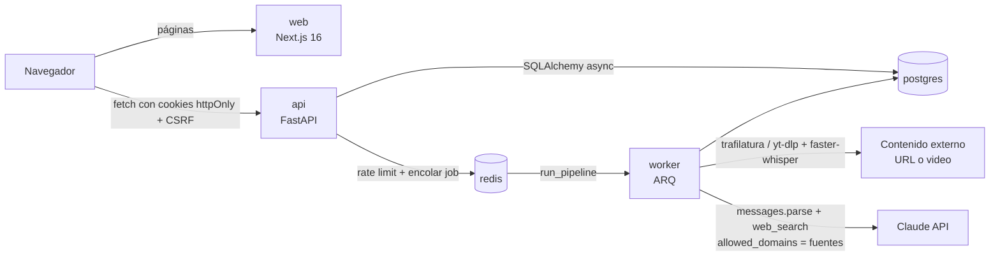

# FakesNews

Plataforma de verificación asistida por IA de noticias sospechosas, con perfil histórico de
confiabilidad de fuentes y autenticación de dos pasos (TOTP).

**Principio de producto:** la plataforma nunca declara una noticia "verdadera" o "falsa". Entrega
un reporte de credibilidad trazable: afirmaciones verificadas, fuentes concretas que las
respaldan/contradicen, y el historial de confiabilidad de cada fuente. Toda conclusión tiene citas
(URL + fragmento + fecha); sin citas, el veredicto es `INSUFFICIENT`.

## Demo en 5 minutos

```bash
cp .env.example .env          # genera JWT_SECRET_KEY y TOTP_SECRET_ENCRYPTION_KEY (ver el archivo)
docker compose up --build -d  # web, api, worker, postgres, redis
make seed                     # usuario demo con 2FA + casos de ejemplo ya procesados
```

`make seed` imprime el email y la contraseña del usuario demo, su secreto TOTP (agrégalo a Google
Authenticator/Authy, o genera el código con `pyotp.TOTP(secreto).now()`) y 10 códigos de
recuperación. Sin `make` (p. ej. en Windows sin GNU Make):
`docker compose exec api uv run python -m app.cli.seed_demo`. Luego:

1. http://localhost:3000/login → email + contraseña → código TOTP → llegas a `/history`.
2. Abre el caso *«Mensaje viral de WhatsApp…»*: reporte con una afirmación respaldada, una
   contradicha y una con evidencia insuficiente, cada una con sus citas y la confiabilidad de cada
   fuente.
3. El caso de URL muestra deduplicación por sindicación (`bbc.com` y `bbc.co.uk` son una sola voz
   independiente); el caso fallido muestra cómo se ve un error del pipeline.
4. `/sources` (público) lista la confiabilidad de las 16 fuentes de confianza.
5. `/submit` envía un caso real. **Requiere `ANTHROPIC_API_KEY` en `.env`**; sin ella el caso
   recorre la cola y termina en `failed` en la extracción de afirmaciones, lo cual también se ve
   en la interfaz.

Detalles del seed (`apps/api/app/cli/seed_demo.py`): es idempotente (el secreto TOTP se conserva
entre ejecuciones; los códigos de recuperación se regeneran porque su texto plano nunca se guarda),
se niega a correr con `ENVIRONMENT=production`, marca todo el contenido con `[DEMO]` y cada
fragmento de evidencia como ilustrativo, y **no** actualiza la reputación de las fuentes — así los
datos inventados de la demo no contaminan los scores reales.

## Arquitectura



| Componente | Responsabilidad |
| --- | --- |
| `apps/web` | UI en Next.js 16 (App Router, componentes cliente). `proxy.ts` solo redirige a `/login` cuando falta la cookie; **la API es el único límite de autorización**. `lib/api.ts` renueva la sesión ante un `401`. |
| `apps/api` — `auth` | Registro, login en dos pasos (contraseña → token limitado → TOTP), sesión con access + refresh rotativo, CSRF de doble envío, lockout y rate limiting. |
| `apps/api` — `submissions` | Crea casos y los encola; estado consultable por polling. |
| `apps/api` — `pipeline` | Worker: `ingest → transcribe → claims → verify → scoring`, con validación de cada cita contra los resultados reales de la búsqueda y la lista blanca de dominios. |
| `apps/api` — `sources` | Fuentes de confianza y su reputación Beta-Bernoulli ([docs/reputation.md](docs/reputation.md)). |
| `apps/api` — `reports` | Arma el reporte de solo lectura a partir de lo persistido (sin llamadas al LLM). |
| `apps/api` — `cli` | `seed_demo` para la demo. |

**Flujo de un caso:** `POST /submissions` → fila `queued` + job en Redis → el worker avanza el
estado (`ingesting → transcribing → extracting → verifying → scoring → done|failed`) → la página
`/reports/[id]` consulta `GET /submissions/{id}` cada 2 s y, al llegar a `done`, pide
`GET /reports/{id}`.

**Modelo de confianza respecto al LLM:** el modelo propone veredictos y citas, pero ninguna cita
llega al reporte sin pasar dos chequeos deterministas (URL presente en los resultados reales de
`web_search` de esa misma respuesta, y dominio en la lista blanca). Sin citas válidas el veredicto
se fuerza a `INSUFFICIENT`. El contenido del usuario viaja delimitado y marcado como no confiable.

### Endpoints

| Método y ruta | Auth | Descripción |
| --- | --- | --- |
| `POST /auth/register` | — | Crea la cuenta (argon2id). |
| `POST /auth/login` | — | Devuelve un token limitado `mfa_setup_pending` o `mfa_pending`. |
| `POST /auth/2fa/setup` · `/auth/2fa/confirm` | token limitado o sesión | Enrolamiento TOTP y códigos de recuperación. |
| `POST /auth/2fa/verify` | token limitado | Emite la sesión completa (cookies). |
| `POST /auth/refresh` · `/auth/logout` | cookie + CSRF | Rota o revoca la sesión. |
| `GET /auth/me` | sesión | Usuario actual. |
| `POST /submissions` | sesión + CSRF | Crea y encola un caso. |
| `GET /submissions` · `/submissions/{id}` | sesión | Historial y estado (solo casos propios). |
| `GET /reports/{id}` | sesión | Reporte de un caso `done` propio (`409` si no terminó). |
| `GET /sources` · `/sources/{domain}` | — | Confiabilidad pública de fuentes. |
| `GET /health` · `/health/ready` | — | Liveness y readiness (DB + Redis). |

Documentación interactiva completa en http://localhost:8000/docs.

## Qué incluye cada fase

- **Fase 1** — Monorepo `apps/web` (Next.js 16 App Router + TypeScript + Tailwind + shadcn/ui) y
  `apps/api` (FastAPI + SQLAlchemy 2 async + Alembic). `docker-compose.yml` con `web`, `api`,
  `worker` (ARQ), `postgres` y `redis`. Health checks, configuración por variables de entorno,
  logging estructurado con redacción de secretos, CORS restringido. Linters: `ruff` (API) y
  `eslint` (web). Pruebas: `pytest` (API).
- **Fase 2** — Registro (argon2id, validación de fortaleza de contraseña) y login que nunca emite
  una sesión completa solo con contraseña: siempre devuelve un token de alcance limitado
  (`mfa_setup_pending` o `mfa_pending`, 5 min). Enrolamiento TOTP (`pyotp`, secreto cifrado en
  reposo con Fernet, QR en base64) con 10 códigos de recuperación de un solo uso. Verificación TOTP
  con ventana ±1 y protección contra reutilización de código. Sesión completa (access 15 min +
  refresh rotativo) solo tras `/auth/2fa/verify`, en cookies httpOnly/SameSite=Lax (Secure se activa
  automáticamente con `ENVIRONMENT=production`), con protección CSRF de doble envío para
  `/auth/refresh` y `/auth/logout`. Detección de reutilización de refresh token (revoca toda la
  familia de tokens). Rate limiting y bloqueo temporal tras 5 intentos fallidos. Páginas
  `/register`, `/login`, `/login/2fa` (QR + códigos de recuperación) y `/settings/security`
  (reenrolamiento), protegidas por `proxy.ts` (Next.js 16 renombró `middleware.ts` a `proxy.ts`).
- **Fase 3** — `POST /submissions` (texto, URL o video) encola el caso en ARQ; `GET /submissions/{id}`
  y `GET /submissions` para consultar estado/listado (pensado para polling cada 2s desde el
  frontend). El worker corre `ingesting → (transcribing) → extracting → verifying → scoring → done`:
  - **ingest**: `trafilatura` para URLs, `yt-dlp` + `faster-whisper` (interfaz `Transcriber`
    intercambiable) para video, con límite de duración validado *antes* de descargar.
  - **claims**: Claude (`client.messages.parse` con `output_format` Pydantic — JSON garantizado por
    schema) extrae hasta 8 afirmaciones factuales autocontenidas, descartando opiniones/predicciones;
    reintenta hasta 3 veces.
  - **verify**: por cada afirmación, una llamada a Claude con la herramienta `web_search`
    (`allowed_domains` = dominios de `sources`, sin dynamic filtering) investiga y devuelve
    veredicto + evidencias en JSON. **Nunca se confía en el JSON del modelo a ciegas**: cada URL de
    evidencia se valida contra los resultados reales que la herramienta de búsqueda devolvió en esa
    misma respuesta (bloques `web_search_tool_result`) y contra la lista blanca de dominios; toda
    evidencia que no pase ambos chequeos se descarta, y si no queda ninguna evidencia válida el
    veredicto se fuerza a `INSUFFICIENT`. Verificaciones en paralelo (`asyncio.Semaphore`) con
    timeout por afirmación; un fallo (timeout, error de API, JSON inválido tras reintentos) marca
    esa afirmación como `INSUFFICIENT` sin tumbar el resto del caso.
  - Defensa contra inyección de prompts: el texto del usuario y la afirmación a verificar siempre
    viajan delimitados (`<document>`/`<claim>`) con instrucción explícita de ignorar cualquier orden
    contenida ahí.
  - `sources/seed_loader.py` carga `trusted_sources.json` en la tabla `sources` de forma idempotente
    (se ejecuta al arrancar el worker).
- **Fase 4** — El paso `scoring` del pipeline ahora actualiza reputación real
  (`sources/reputation.py`, ver la fórmula completa y sus limitaciones en `docs/reputation.md`):
  modelo Beta-Bernoulli (`score = alpha/(alpha+beta)`), consenso ponderado entre fuentes (peso =
  score actual con piso de 0.05), deduplicación de fuentes sindicadas (`syndication_group`) para
  que no infle el conteo de independencia ni el voto de consenso, mínimo 2 fuentes independientes
  para puntuar, e idempotencia garantizada por una restricción única `(source_id, claim_id)` en
  `source_score_events`. `GET /sources` y `GET /sources/{domain}` (públicos, sin autenticación)
  exponen score, `cases_count`, bandera `low_sample` (<10 casos), intervalo aproximado (aproximación
  normal a la Beta) e historial reciente de eventos.

- **Fase 5** — `GET /reports/{submission_id}` (módulo `reports`, solo el dueño del caso; un caso
  ajeno responde `404` igual que uno inexistente, y uno sin terminar responde `409`) arma el
  reporte de credibilidad a partir de lo que el pipeline ya persistió — no hace llamadas al LLM:
  resumen de veredictos, cada afirmación con su razonamiento y su evidencia (URL + fragmento +
  fecha + postura), y para cada evidencia el score de la fuente, `cases_count` y `low_sample`.
  Incluye siempre un descargo que recuerda que el reporte no declara nada verdadero ni falso.
  `GET /submissions` ahora también devuelve `raw_input` (para el historial). Frontend:
  `/submit` (texto, URL o video), `/reports/[id]` (polling cada 2s con barra de progreso por
  etapa del pipeline y luego el reporte con citas enlazadas), `/history` (casos del usuario),
  `/sources` (listado público de confiabilidad). Tras el 2FA se redirige a `/history`.
  `apiFetch` renueva la sesión automáticamente ante un `401` (una sola llamada a `/auth/refresh`
  compartida entre peticiones concurrentes para no reutilizar el refresh token rotativo, y
  reenviando el token CSRF nuevo en el reintento).

- **Fase 6** — `make seed` real (`python -m app.cli.seed_demo`, dentro del paquete de la API para
  que exista en la imagen de Docker — el placeholder anterior en `scripts/` quedaba fuera del
  contexto de build y no podía ejecutarse en el contenedor). Arquitectura, diagrama, tabla de
  endpoints y guía de demo en este README. Corrección tipográfica: `--font-sans` se referenciaba a
  sí misma en `globals.css`, así que Geist nunca se aplicaba y el navegador caía en una fuente
  serif. Recorrido de punta a punta validado en navegador contra el stack en Docker (login + TOTP
  → historial → reporte → caso fallido → fuentes → envío real).

### Cómo probar el 2FA manualmente

1. `POST /auth/register` con `email`/`password`.
2. `POST /auth/login` → devuelve `{token, token_type: "mfa_setup_pending", expires_in}`.
3. `POST /auth/2fa/setup` con `Authorization: Bearer <token>` → devuelve `otpauth_uri` y
   `qr_code_base64`. Puedes decodificar el QR o extraer el parámetro `secret` de la URI y generarlo
   con cualquier librería TOTP (p. ej. `pyotp.TOTP(secret).now()`).
4. `POST /auth/2fa/confirm` con el mismo bearer token y `{"code": "<código de 6 dígitos>"}` →
   activa 2FA y devuelve 10 `recovery_codes` (solo se muestran una vez).
5. `POST /auth/2fa/verify` con el mismo bearer token y `{"code": "..."}` o
   `{"recovery_code": "..."}` → responde `Set-Cookie` con `access_token`, `refresh_token` y
   `csrf_token`.
6. Desde el navegador, el flujo completo está en `/login` → `/login/2fa` (muestra el QR y los
   códigos de recuperación con opción de descarga).

## Cómo levantar el proyecto

```bash
cp .env.example .env
# Edita .env: como mínimo, genera JWT_SECRET_KEY y TOTP_SECRET_ENCRYPTION_KEY (instrucciones
# dentro del archivo). Sin ANTHROPIC_API_KEY el pipeline de verificación (Fase 3) encola y corre,
# pero cada caso termina en status=failed al llegar al paso de extracción de afirmaciones.

docker compose up --build
make seed   # opcional: usuario demo + casos de ejemplo (ver "Demo en 5 minutos")
```

- Web: http://localhost:3000
- API: http://localhost:8000 (docs interactivas en http://localhost:8000/docs)
- Postgres: localhost:5432, Redis: localhost:6379

## Despliegue en Railway

El despliegue necesita cinco servicios: `web`, `api`, `worker`, PostgreSQL y Redis. Railway no
ejecuta este `docker-compose.yml` directamente; crea cada servicio desde el mismo repositorio y usa
las bases de datos gestionadas de Railway.

1. Crea PostgreSQL y Redis en el proyecto Railway y nombra los servicios exactamente `Postgres` y
   `Redis` para que las referencias de variables del ejemplo se resuelvan.
2. Crea `api` desde el repositorio con directorio raíz `apps/api` y el archivo de configuración
   `/railway.toml`. Este ejecuta las migraciones antes de arrancar y comprueba `/health/ready`.
3. Crea `worker` desde el mismo repositorio y directorio raíz `apps/api`; selecciona
   `/apps/api/railway.worker.toml` como archivo de configuración. El worker consume la cola Redis y
   procesa los casos.
4. Crea `web` desde el repositorio con directorio raíz `apps/web` y su Dockerfile.
5. Añade un dominio personalizado a `web` (por ejemplo, `app.example.com`) y otro a `api`
   (`api.example.com`). Deben compartir el mismo dominio raíz para que el navegador envíe las
   cookies de sesión `SameSite=Lax` en las llamadas de la web a la API. Los dominios
   `*.up.railway.app` no sirven para esto: `up.railway.app` es un sufijo público y el navegador
   no comparte cookies entre sus subdominios.

Configura estas variables en `api` y `worker` (puedes compartir las variables comunes del proyecto):

```dotenv
ENVIRONMENT=production
DATABASE_URL=${{Postgres.DATABASE_URL}}
REDIS_URL=${{Redis.REDIS_URL}}
JWT_SECRET_KEY=<secreto aleatorio de al menos 48 bytes>
TOTP_SECRET_ENCRYPTION_KEY=<clave Fernet generada para este entorno>
ANTHROPIC_API_KEY=<clave de Anthropic>
ANTHROPIC_MODEL=claude-sonnet-5
CORS_ORIGINS=["https://app.example.com"]
COOKIE_DOMAIN=.example.com
```

`COOKIE_DOMAIN` es obligatorio cuando web y API están en subdominios distintos: sin él, las cookies
quedan atadas a `api.example.com`, la web no puede leer `csrf_token` (todo `POST` falla con `403`) y
`proxy.ts` no ve la sesión, así que cada página protegida redirige a `/login`.

La API arranca con el `CMD` del Dockerfile, que escucha en el `$PORT` que inyecta Railway. Para que
el rate limiting y el bloqueo por intentos usen la IP real del cliente, configura
`TRUSTED_PROXY_HOPS=1` (solo el proxy de Railway). La API toma la IP contando proxies desde la derecha
de `X-Forwarded-For`, así un cliente no puede falsificarla añadiendo entradas a la cabecera.

En `web`, configura `NEXT_PUBLIC_API_URL=https://api.example.com`. Es una variable de build y debe
estar definida antes de desplegar la web. La API normaliza las URLs PostgreSQL `postgres://` y
`postgresql://` del proveedor al driver `asyncpg` requerido por la aplicación.

### Web en Vercel sin dominio propio

Si la web está en `*.vercel.app` y la API en `*.up.railway.app`, no comparten dominio y las cookies
no llegarían. En ese caso la web hace de proxy de la API en `/api`, así las cookies quedan en el
dominio de la web:

- En Vercel (directorio raíz `apps/web`): `NEXT_PUBLIC_API_URL=/api` y
  `API_PROXY_TARGET=https://<api>.up.railway.app`. Ambas se leen al compilar.
- En `api`: `COOKIE_PATH_PREFIX=/api`, `COOKIE_DOMAIN` vacío,
  `CORS_ORIGINS=["https://<web>.vercel.app"]` y `TRUSTED_PROXY_HOPS=2` (Vercel + Railway).

Genera los secretos con los comandos documentados en [.env.example](.env.example); no reutilices
claves entre desarrollo y producción. El procesamiento con Claude requiere una clave con acceso a
`messages.parse` y a la herramienta de búsqueda web. Configura recursos suficientes para el worker:
la transcripción de video usa FFmpeg y descarga el modelo Whisper al procesar videos.

Tras el primer despliegue, comprueba `https://api.example.com/health/ready`, abre la web y completa
un registro/login con TOTP. Envía un texto de prueba y revisa que el worker lo lleve a `done`; un
estado `failed` suele indicar una clave/modelo de Anthropic inválido o un error de acceso al
servicio externo. No ejecutes `make seed` en producción.

## Desarrollo local del backend (sin Docker)

```bash
cd apps/api
uv sync
uv run pytest
uv run ruff check .
```

## Desarrollo local del frontend (sin Docker)

```bash
cd apps/web
pnpm install
pnpm dev
pnpm run lint
```

## Variables de entorno

Ver `.env.example` en la raíz — cada variable está documentada ahí mismo. Nunca commitees el
archivo `.env` real.

## Limitaciones conocidas

Lista consolidada, agrupada por la fase en que se introdujo cada componente.

- General: el sistema mide consistencia entre fuentes de una lista blanca fija de 16 dominios; no
  es un fact-checker objetivo ni cubre medios fuera de esa lista. No hay panel de administración
  para editar fuentes (se editan en `app/data/trusted_sources.json`). En desarrollo todo se sirve
  por HTTP; la bandera `Secure` de las cookies depende de `ENVIRONMENT=production` y de un proxy
  TLS delante, que no forma parte de este `docker-compose.yml`.
- Fase 2: un lockout de cuenta responde `423` en vez de `401` cuando el email existe y está
  bloqueado, lo cual filtra mínimamente si un email está registrado (trade-off común de los
  esquemas de lockout; no hay mitigación adicional en el MVP). `/2fa/confirm` no rota
  `totp_last_used_step` a propósito (ver comentarios en `service.py`), así que el mismo código
  puede reutilizarse entre `/2fa/confirm` y el siguiente `/2fa/verify` inmediato — la reutilización
  sí se bloquea a partir de ahí.
- Fase 3: sin `ANTHROPIC_API_KEY` configurada, cualquier caso termina en `status=failed` en el paso
  de extracción de afirmaciones (validado deliberadamente así en el stack real — ver historial de
  build). El campo `evidence.published_at` es texto libre (`page_age` de la búsqueda, p. ej.
  "April 30, 2025"), no una fecha normalizada. La ruta de video (`yt-dlp` + `faster-whisper`) está
  cubierta por pruebas unitarias con mocks, pero no se probó con una descarga/transcripción real
  contra el stack en Docker (sí se probaron `text` y `url` de punta a punta). Ingesta de URL/video protegida
  contra SSRF (`pipeline/url_safety.py`): se valida el esquema y se resuelve el host antes de
  descargar, rechazando loopback/red privada/link-local (incluye endpoints de metadata cloud como
  `169.254.169.254`); video además restringido a una lista blanca de plataformas conocidas
  (`ALLOWED_VIDEO_HOSTS`). Validado en vivo contra el stack en Docker apuntando a un servicio
  interno (`postgres:5432`), un endpoint de metadata y `localhost` — los tres se bloquean antes de
  hacer ninguna petición. Limitación conocida: la validación no cubre redirecciones HTTP (un host
  público validado podría redirigir a una dirección interna en un salto posterior); mitigarlo del
  todo requeriría deshabilitar redirecciones en `trafilatura`/`yt-dlp` y revalidar cada salto
  manualmente, fuera de alcance para este MVP.
- Fase 4: el sistema de reputación tiene una circularidad de diseño conocida y documentada en
  detalle en `docs/reputation.md` — el peso de cada fuente en el consenso es su propio score
  actual, lo que puede autoreforzar sesgos iniciales en vez de corregirlos, y el sistema mide
  consenso entre fuentes, no verdad objetiva (una fuente minoritaria pero correcta puede recibir un
  `miss`). El intervalo de confianza es una aproximación normal a la Beta, no el cuantil exacto.
- Fase 5: el reporte solo existe para casos en estado `done`; un caso `failed` muestra el error
  pero no un reporte parcial, aunque algunas afirmaciones se hubieran verificado. Las páginas de
  casos son componentes cliente que consultan la API desde el navegador (sin render en servidor).
  No hay exportación del reporte (PDF/Markdown).
- Fase 6: los casos del seed usan evidencia ilustrativa (marcada como tal) con URLs a la portada
  de cada fuente, no a artículos concretos. La contraseña del usuario demo es fija y se imprime en
  consola: el seed se niega a correr en producción, pero no debe usarse en un entorno expuesto.
